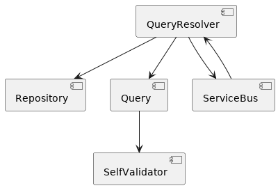
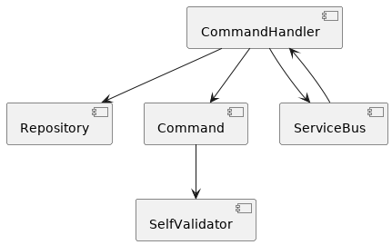
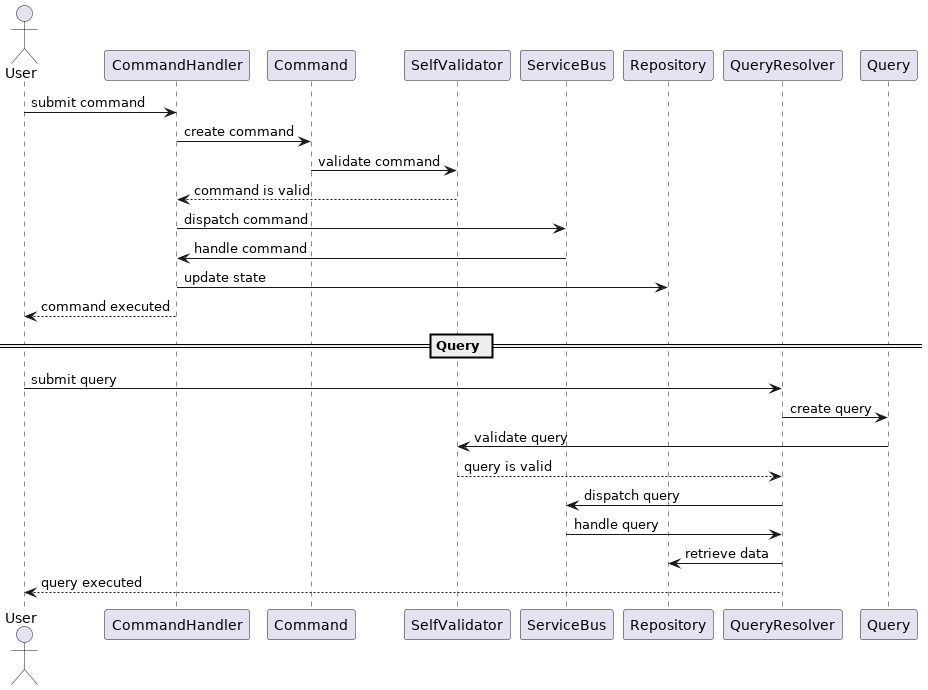

## CQRS Spring Boot Project

This project is a demonstration of the Command-Query Responsibility Segregation (CQRS) pattern using Spring Boot.

**Getting Started**

These instructions will get you a copy of the project up and running on your local machine for development and testing purposes.

**Prerequisites**

 - Java 8 or later 
 - Maven 3.6.0 or later

**Installation**

- Clone the repository: git clone https://github.com/mmendespro/spring-cqrs-poc.git
- Navigate to the project directory: cd cqrs-spring-boot
- Build the project: mvn clean install
- Run the project: mvn spring-boot:run

**Project Structure**

The project is divided into tree main components:
 - Command Side: Responsible for handling command requests and updating the state of the system.
 - Query Side: Responsible for handling query requests and providing a read-only view of the system's state.
 - Service Bus: With lazy load of queries resolvers and command handlers. 

**Built With**
- Spring Boot - The web framework used
- Maven - Dependency Management

**UML Component Diagram of CQRS**

The diagram shows the main components of the CQRS pattern and how they interact with each other. The application layer contains the CommandHandler, QueryHandler, CommandValidator and QueryValidator classes. The domain layer contains the Command, Query, Aggregate and Repository classes. The infrastructure layer contains the CommandBus and QueryBus classes. The CommandHandler class is responsible for handling the commands and updating the state of the aggregate. The QueryHandler class is responsible for handling the queries and retrieving the data from the repository. The CommandValidator and QueryValidator classes are responsible for validating the commands and queries respectively. The CommandBus and QueryBus classes are responsible for routing the commands and queries to the appropriate handlers.

**UML Sequence Diagram of CQRS**

Example of a sequence diagram that represents the Command Query Responsibility Segregation (CQRS) pattern implemented in this project:

